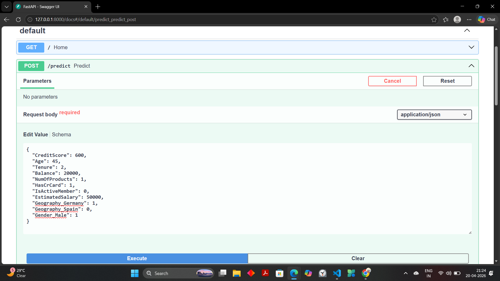
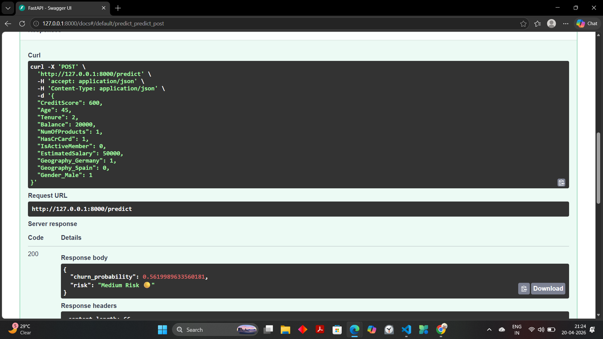

# 🧠 Customer Churn Early Warning System

<p align="center">
  
  
  
  
  
  
</p>

---

## 📌 Overview

An **end-to-end Machine Learning system** that predicts customer churn and enables proactive business decisions using data-driven insights.

---

## 🧠 Business Problem

Banks lose customers silently, leading to revenue loss.  
Acquiring new customers is significantly more expensive than retaining existing ones.

👉 **Goal:** Identify high-risk customers *before* they churn.

---

## 💡 Solution

- Predict churn using **XGBoost**
- Segment customers into **risk categories**
- Serve predictions via **FastAPI**
- Store outputs in **MySQL**
- Visualize insights in **Power BI**

---

## 🏗️ System Architecture
Customer Data
↓
Feature Engineering
↓
ML Model (XGBoost)
↓
FastAPI API
↓
MySQL Database
↓
Power BI Dashboard
↓
Business Actions


---

## ⚙️ Tech Stack

| Category | Tools |
|----------|------|
| Language | Python |
| ML Model | XGBoost |
| Backend | FastAPI |
| Database | MySQL |
| Visualization | Power BI |
| Explainability | SHAP |

---

## 📁 Project Structure
churn-system/
│── api/
│── src/
│── models/
│── data/
│── dashboard/
│── notebooks/
│── README.md


---

## 🚀 Key Features

- Churn Prediction Model  
- Feature Engineering  
- Model Optimization  
- SHAP Explainability  
- API Deployment  
- SQL Integration  
- Business Dashboard  

---

## 🎥 Demo

### 🔌 FastAPI
  


### 📊 Dashboard
  
  
  


---

## 📈 Model Performance

- Accuracy: 86.2%  
- ROC-AUC: 0.73  

### Classification Report

| Class | Precision | Recall | F1-score |
|------|----------|--------|----------|
| Non-Churn | 0.89 | 0.95 | 0.92 |
| Churn | 0.70 | 0.51 | 0.59 |

### Insight

Model performs well on non-churn users but has moderate recall for churn due to class imbalance.

👉 Future improvement: SMOTE / class balancing

---

## 💼 Business Actions

- 🔴 High Risk → Retention offers  
- 🟡 Medium Risk → Engagement campaigns  
- 🟢 Low Risk → Loyalty rewards  

---

## 🔌 API Usage

### ▶️ Run Server

```bash
uvicorn api.main:app --reload

📍 Endpoint
POST /predict
📥 Request
{
  "CreditScore": 600,
  "Age": 45,
  "Tenure": 2,
  "Balance": 20000,
  "NumOfProducts": 1,
  "HasCrCard": 1,
  "IsActiveMember": 0,
  "EstimatedSalary": 50000,
  "Geography_Germany": 1,
  "Geography_Spain": 0,
  "Gender_Male": 1
}

📤 Response
{
  "churn_probability": 0.82,
  "risk": "High Risk"
}

📂 Dataset
Bank Churn Modelling Dataset (Kaggle)
Not included due to size

---
🧪 Run Locally
git clone https://github.com/swati-mishra07/customer-churn-system.git
cd churn-system
python -m venv venv
venv\Scripts\activate
pip install -r requirements.txt
uvicorn api.main:app --reload

---
🎤 Interview Explanation
Built an end-to-end churn prediction system using XGBoost, deployed via FastAPI, integrated with MySQL, and visualized insights using Power BI.

🏆 Unique Points

- ML + Backend + BI integration
- Real business use-case
- Production-style architecture

📌 Future Improvements
- Cloud deployment
- Real-time data pipeline
- Frontend app
- Auto retraining

---
👩‍💻 Author
Swati Mishra

- GitHub: https://github.com/swati-mishra07
- LinkedIn: https://www.linkedin.com/in/swati-mishra-801193308

---

