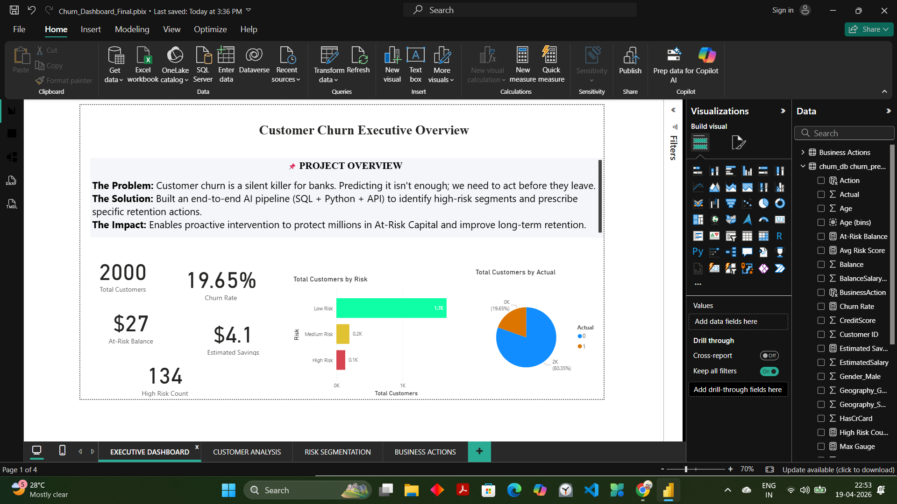
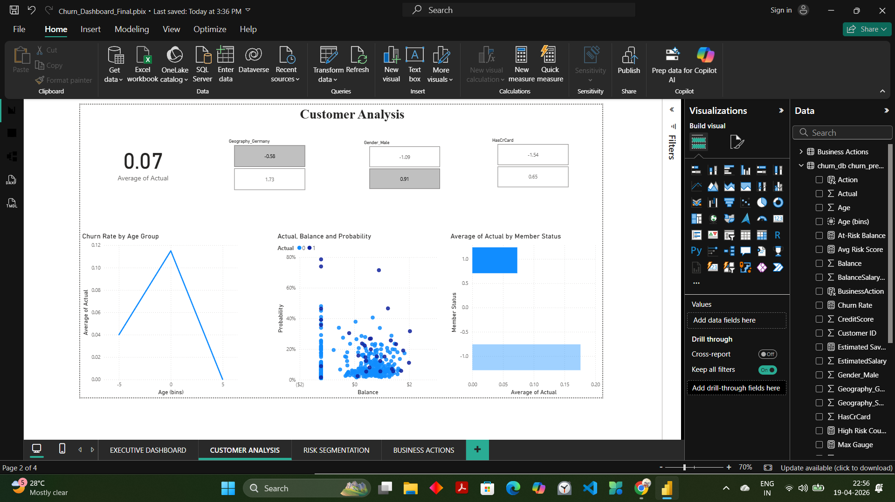
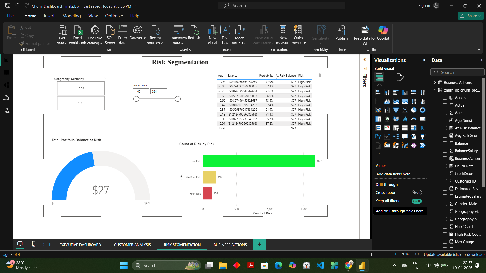
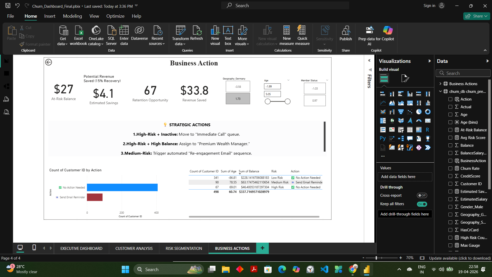

# 🧠 Customer Churn Early Warning System

<p align="center">
  
  
  
  
  
  
</p>

---

## 📌 Overview

An **end-to-end Machine Learning system** that predicts customer churn and recommends actionable business strategies.  
The project integrates **ML, API, Database, and Business Intelligence** to enable real-time decision-making.

---

## 🧠 Business Problem

Banks lose customers silently, leading to revenue loss.  
Acquiring new customers is significantly more expensive than retaining existing ones.

👉 **Goal:** Identify high-risk customers *before* they churn and take proactive actions.

---

## 💡 Solution

This system:

- Predicts churn probability using **XGBoost**
- Segments customers into **High / Medium / Low Risk**
- Provides **actionable recommendations**
- Serves predictions via **FastAPI**
- Stores results in **MySQL**
- Visualizes insights through **Power BI dashboard**

---

## 🏗️ System Architecture
- Customer Data
- ↓
- Feature Engineering
- ↓
- ML Model (XGBoost)
- ↓
- FastAPI (Real-time API)
- ↓
- MySQL Database
- ↓
- Power BI Dashboard
- ↓
- Business Actions


---

## ⚙️ Tech Stack

| Category | Tools |
|--------|------|
| Language | Python |
| ML Model | XGBoost |
| Backend | FastAPI |
| Database | MySQL |
| Visualization | Power BI |
| Explainability | SHAP |

---

## 🚀 Key Features

- ✅ Churn Prediction Model (Classification)
- ✅ Feature Engineering & Data Preprocessing
- ✅ Model Optimization (GridSearchCV)
- ✅ SHAP Explainability
- ✅ Risk Segmentation
- ✅ Real-time API Deployment
- ✅ SQL Data Integration
- ✅ Business KPI Dashboard
- ✅ Action Recommendation System

---

## 📊 Dashboard Preview

### 🟣 Executive Overview


### 🔵 Customer Analysis


### 🟠 Risk Segmentation


### 🔴 Business Actions


---

## 🧠 Business Impact

- Identify high-risk customers early  
- Improve retention strategies  
- Reduce churn rate  
- Increase customer lifetime value  
- Enable data-driven decision-making  

---

## 🔌 API Usage

### ▶️ Run Server

```bash
uvicorn api.main:app --reload

## 📍 Endpoint

POST /predict

📥 Sample Request
{
  "CreditScore": 600,
  "Age": 45,
  "Tenure": 2,
  "Balance": 20000,
  "NumOfProducts": 1,
  "HasCrCard": 1,
  "IsActiveMember": 0,
  "EstimatedSalary": 50000,
  "Geography_Germany": 1,
  "Geography_Spain": 0,
  "Gender_Male": 1
}

📤 Sample Response
{
  "churn_probability": 0.82,
  "risk": "High Risk 🔴"
}


## 🧪 How to Run Locally

git clone <https://github.com/swati-mishra07/customer-churn-system.git>
cd churn-system
python -m venv venv
venv\Scripts\activate
pip install -r requirements.txt
uvicorn api.main:app --reload


##🎤 Interview Explanation
I built an end-to-end customer churn prediction system using XGBoost, deployed it via FastAPI for real-time predictions, stored results in MySQL, and created a Power BI dashboard with KPIs and actionable insights to support business decisions.

##🏆 What Makes This Project Unique
- Goes beyond prediction → decision-making system
-Combines Machine Learning + Backend + Business Intelligence
-Focuses on real-world business impact
-Designed with production-level architecture

## 📌 Future Improvements

- Deploy API to cloud (Render / AWS)
- Add real-time data streaming
- Build frontend dashboard (React)
- Automate model retraining pipeline

---

👩‍💻 Author
- Swati Mishra

- GitHub: https://github.com/swati-mishra07
- LinkedIn: https://www.linkedin.com/in/swati-mishra-801193308

